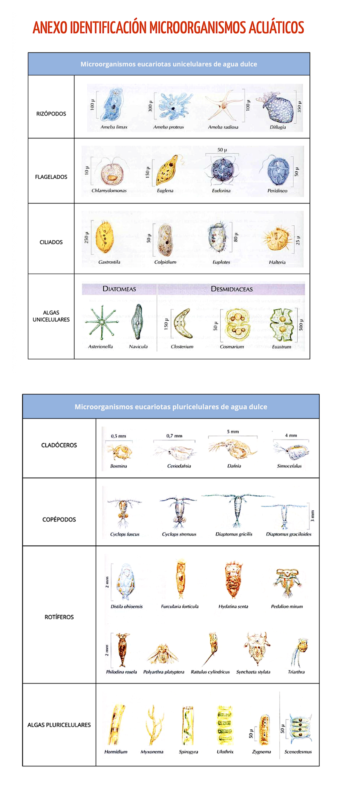

# P03 — Tinción vital con azul de metileno

> **Estado de esta página:** Completa individualmente los bloques **[ALUMNADO · RELLENABLE]** durante o después de la práctica. La preparación puede realizarse por parejas, pero el registro, la interpretación comparada, las imágenes seleccionadas y la reflexión deben ser personales.

## 1. Identificación de la práctica

| Campo | Información |
|---|---|
| Código y título | `P03 — Tinción vital con azul de metileno` |
| Unidad didáctica | `UD2 — Bacteriología: técnicas de tinción y observación` |
| Resultado de aprendizaje | `RA02` |
| Criterios de evaluación | `CE02.a–CE02.g` |
| Aprendizaje transversal | `RA01 — bioseguridad` |
| Agrupamiento | Preparación y manejo del microscopio por parejas; interpretación y registro individual. |
| Instrumentos vinculados | Prueba práctica, cuaderno o portfolio de prácticas y prueba teórica. |
| Modalidad prevista | Muestra autorizada o material docente seguro, colorante azul de metileno vigente y documentación de seguridad disponible. |

## 2. Resumen

En esta práctica aplicarás o interpretarás una tinción directa con azul de metileno y la compararás con la observación en fresco de P02. La tinción vital corresponde a la muestra fresca sin centrifugar. Si se autoriza la centrifugación, prepararás una muestra concentrada y teñida después; esta variante no permite inferir movilidad ni viabilidad. Registrarás el reactivo, los aumentos, los controles, los hallazgos y las limitaciones, con imágenes autorizadas e identificaciones solo orientativas.

## 3. Finalidad y resultados esperados

La tinción directa con azul de metileno aumenta el contraste de una muestra fresca sin centrifugar y se compara con su preparación en fresco de P02. La modalidad centrifugada es una adaptación docente distinta: concentra la muestra antes de teñirla y no debe interpretarse como una prueba de viabilidad.

Al finalizar deberás poder:

- manipular un colorante de forma segura conforme a su FDS;
- preparar o analizar una tinción vital directa válida, sin comprometer la calidad de la muestra;
- observar y describir las estructuras visibles tras la tinción;
- comparar el contraste, la morfología observable y las limitaciones de una preparación teñida frente a una preparación en fresco; y
- comunicar el resultado mediante registro técnico, imágenes y una interpretación razonada.

## 4. Recursos, seguridad y autorización

**Recursos previstos:** microscopio óptico, portaobjetos y cubreobjetos limpios, pipeta Pasteur o gotero, papel absorbente, muestra o preparación docente autorizada y solución de azul de metileno apta para uso docente. Si el centro autoriza prepararla, se requieren azul de metileno en polvo, balanza, espátula, material de pesada, agua destilada y matraz aforado de 100 mL.

**Responsabilidad del centro:** proporcionar un reactivo vigente, correctamente etiquetado y con la ficha de datos de seguridad (FDS) accesible. El centro debe autorizar la preparación de la solución al 0,5 % p/v y confirmar el método, el EPI, el almacenamiento y la gestión de residuos. La centrifugación, el posible uso de vaselina y los aumentos también requieren protocolo local validado.

**Riesgos:** exposición al colorante, salpicaduras, manchas, contacto con muestra autorizada, rotura o corte con vidrio y gestión incorrecta de residuos químicos.

**Medidas obligatorias:** usar el EPI indicado por la FDS y el centro; evitar salpicaduras y aerosoles; trabajar sobre una superficie protegida cuando se indique; no pipetear con la boca; gestionar el colorante y el vidrio por la ruta de residuos comunicada; limpiar el puesto e higienizar las manos al finalizar.

> **Aviso de seguridad.** La práctica es `CONDITIONAL`: requiere reactivo vigente, FDS disponible, material docente autorizado, EPI y circuito de residuos químicos confirmado. Si falta alguno de estos elementos, se utilizarán preparaciones teñidas, imágenes o resultados docentes ya preparados, identificándolos como tales.

## 5. Fundamento técnico

La tinción vital directa con azul de metileno puede aumentar el contraste de una muestra fresca y resaltar algunas estructuras, pero el colorante también puede modificar su aspecto. La FDS del reactivo determina las medidas de manipulación; la tinción no permite por sí sola una identificación definitiva.

La comparación con la preparación en fresco es esencial: la tinción puede facilitar el reconocimiento de contornos y detalles, mientras que la preparación sin teñir puede aportar otra información sobre el comportamiento de la muestra. Cualquier movimiento observado debe analizarse con cautela, diferenciándolo de corrientes, vibraciones o artefactos.

La ficha contempla dos rutas: tinción vital directa de la muestra fresca sin centrifugar y preparación concentrada por centrifugación seguida, si se autoriza localmente, de una tinción. La solución propuesta es azul de metileno al 0,5 % p/v y solo se prepara con autorización docente y FDS disponible. El PNT citado orienta sobre muestras frescas, pero no establece esa concentración ni valida la centrifugación de agua estancada.

## 6. Procedimiento y controles de calidad

### Procedimiento base

1. Revisar la autorización de la muestra o del material docente, la FDS, el EPI y el circuito de residuos.
2. Preparar un portaobjetos y cubreobjetos limpios, y etiquetar la preparación según las indicaciones recibidas.
3. Depositar la cantidad de muestra indicada por el centro en el portaobjetos.
4. Añadir la cantidad indicada de solución de azul de metileno y homogeneizar con el método autorizado, evitando salpicaduras y exceso de manipulación.
5. Colocar el cubreobjetos inclinado para reducir la formación de burbujas; aplicar el método de sellado únicamente si ha sido autorizado.
6. Observar al microscopio de menor a mayor aumento, registrando el aumento y los ajustes efectivamente utilizados.
7. Comparar la preparación teñida con la observación en fresco, registrar las diferencias y seleccionar evidencias visuales válidas.
8. Retirar la preparación, limpiar el puesto y gestionar los residuos químicos y de vidrio conforme al protocolo.

### Procedimiento específico

**PNT de referencia:** [SEIMC, PNT-GE-03: diagnóstico microbiológico de las infecciones gastrointestinales parasitarias (2008; descargar PDF)](https://seimc.org/wp-content/uploads/2025/06/seimc-procedimientomicrobiologia30.pdf)

El PNT-GE-03 describe el examen parasitológico de muestras fecales; aquí se toma únicamente como referencia técnica para la preparación fresca con azul de metileno. No valida el análisis de agua estancada, la concentración del colorante ni la centrifugación de esta ficha. Indica usar la tinción en muestras frescas sin conservantes y advierte que la concentración puede destruir trofozoítos. La viabilidad y los parámetros locales deben confirmarse antes de ejecutar cada modalidad.

#### Procedimiento previo. Preparación de la solución de azul de metileno al 0,5 % p/v

**Referencias técnicas para la pesada y preparación de disoluciones:** [Universitat de València, *Operaciones básicas del laboratorio analítico*, apartados 4.1 y 4.3](https://www.uv.es/gammmm/Subsitio%20Operaciones/4%20Operaciones%20Basicas.htm), y [*Cuaderno de laboratorio de Química (Grado en Biología)*, procedimiento general para preparar una disolución](https://www.uv.es/organica/CUADERNOS%20LABORATORIOS/cuadernillos%20CASTELLANO/GBIOLOGIA_QUIMICA_CuadernoLaboratorio1516.pdf), para pesar, disolver, transferir cuantitativamente, enrasar y homogeneizar. Para criterios sobre pesada y balanzas: [EDQM, Consejo de Europa, *Weighing according to the European Pharmacopoeia* (2022)](https://www.edqm.eu/en/-/pesage-dans-la-pharmacop%C3%A9e-europ%C3%A9enne). Estas referencias respaldan las operaciones generales; no fijan la concentración de azul de metileno ni sustituyen la FDS o la autorización del centro.

1. Confirma la autorización docente, la FDS y el protocolo del centro; si falta alguno, no prepares el colorante y solicita la solución de trabajo aprobada.
2. Ponte el EPI indicado, protege la superficie y reúne balanza, espátula, material de pesada, vaso, varilla, agua destilada y matraz aforado de 100 mL.
3. Comprueba que el reactivo esté identificado y vigente; etiqueta el matraz con el nombre del colorante y la concentración objetivo antes de comenzar.
4. Tara el material de pesada y mide 0,50 g de azul de metileno en polvo; evita generar polvo y sigue las medidas de la FDS.
5. Añade al vaso una porción de agua destilada, incorpora el colorante y mezcla con la varilla hasta disolverlo.
6. Transfiere la solución al matraz aforado; enjuaga el vaso y la varilla con pequeñas porciones de agua destilada y añade los enjuagues.
7. Completa con agua destilada hasta la marca de 100 mL, tapa el matraz y homogeneiza invirtiéndolo varias veces.
8. Completa la etiqueta con concentración 0,5 % p/v, fecha, responsable y condiciones de conservación o caducidad indicadas por el centro; limpia y gestiona residuos según FDS.

#### A. Tinción vital directa sin centrifugación

1. Confirma la autorización y procedencia docente de la muestra; para la tinción vital directa, comprueba que esté fresca y sin conservantes.
2. Revisa la FDS y el etiquetado del azul de metileno; ponte el EPI indicado y prepara material limpio e íntegro.
3. Identifica el portaobjetos con el código de muestra, sin datos personales, y protege la superficie de trabajo según el protocolo del centro.
4. Homogeneiza suavemente la muestra cerrada solo si lo indica el centro; evita aerosoles, salpicaduras y contaminación cruzada.
5. Deposita en el portaobjetos una gota de muestra con pipeta Pasteur limpia; no reutilices la pipeta entre muestras.
6. Añade la cantidad de solución de azul de metileno especificada por el protocolo validado; no prepares ni diluyas reactivo sin autorización.
7. Mezcla suavemente con material limpio, si así lo establece el método; evita extender la gota fuera del área de observación.
8. Coloca el cubreobjetos desde un borde y bájalo lentamente para reducir burbujas; no presiones ni selles salvo autorización expresa.
9. Observa pronto con el microscopio y la secuencia de aumentos indicada por el centro; evita que la preparación se seque.
10. Registra aumento, contraste, morfología y artefactos; interpreta la tinción solo dentro de sus límites y compárala con P02.
11. Retira la preparación y elimina muestra, colorante, vidrio y material usado por las rutas designadas; limpia el puesto e informa incidencias.

#### B. Preparación concentrada con centrifugación y tinción posterior

Esta ruta es una adaptación docente, no una tinción vital validada por el PNT. La concentración puede destruir trofozoítos; no interpretes movimiento ni viabilidad en esta preparación.

1. Confirma que la muestra y la centrifugación estén autorizadas; usa solo material docente seguro y no continúes sin parámetros locales validados.
2. Verifica FDS, EPI, tubos compatibles e íntegros, rotor aprobado y protocolo que especifique volumen, fuerza relativa, tiempo y fracción que se recuperará.
3. Identifica el tubo y prepara la alícuota con el volumen establecido en el protocolo docente validado; registra ese volumen antes de centrifugar.
4. Equilibra los tubos con la misma carga y disposición indicada por el fabricante; cierra tapas y comprueba el rotor antes de iniciar.
5. Centrifuga con la fuerza relativa y el tiempo aprobados para ese rotor; no conviertas ni extrapoles rpm entre equipos.
6. Espera la detención completa del rotor antes de abrir; ante rotura, fuga o vibración anómala, no manipules el contenido y avisa al docente.
7. Retira el tubo verticalmente y recupera solo la fracción —sedimento o sobrenadante— indicada por el protocolo validado.
8. Deposita una gota de esa fracción en un portaobjetos limpio e identificado; usa pipeta limpia y evita resuspender material no indicado.
9. Añade azul de metileno solo si el protocolo docente autoriza esta adaptación y especifica reactivo y cantidad; no la presentes como método validado por SEIMC.
10. Mezcla suavemente si está indicado y coloca el cubreobjetos desde un borde; evita burbujas, presión y sellado no autorizado.
11. Observa con el microscopio y los aumentos indicados; registra que hubo centrifugación y la fracción examinada.
12. No infieras movilidad ni viabilidad a partir de esta preparación: la concentración puede destruir trofozoítos y alterar la muestra.
13. Gestiona tubo, preparación, colorante y material usado según las rutas del centro; limpia el equipo según instrucciones e informa incidencias.

### Controles de calidad

- Reactivo identificado, vigente y utilizado conforme a la FDS.
- Preparación limpia, correctamente rotulada y sin burbujas que impidan la lectura.
- Cantidad de colorante y homogeneización adecuadas: sin precipitados o sobreteñido que impidan interpretar el campo.
- Enfoque, iluminación y aumento adecuados para la observación.
- Comparación explícita y razonada con la preparación en fresco.
- Imagen o esquema suficiente para apoyar el resultado, con pie de foto técnico y origen declarado.

---

# Tu cuaderno de prácticas

## 7. Datos de realización [ALUMNADO · RELLENABLE · DURANTE]

- **Nombre y apellidos:** [Escribe tu nombre y apellidos]
- **Fecha real de realización:** [dd/mm/aaaa]
- **Grupo:** [Indica tu grupo]
- **Pareja de trabajo, si procede:** [Indica el nombre o escribe “Trabajo individual”]
- **Rol o tarea principal que realizaste:** [Describe tu participación]
- **Modalidad realmente realizada:** [Muestra autorizada / preparación docente teñida / imagen o vídeo / otra; descríbela]
- **Código o descripción de la muestra/material docente:** [Completa sin incluir datos personales o clínicos]
- **Reactivo utilizado:** [Nombre, concentración indicada por el centro, lote o referencia si procede]

## 8. Preparación y análisis inicial [ALUMNADO · RELLENABLE · DURANTE]

### 8.1 Verificación previa

| Comprobación | Registro |
|---|---|
| Autorización o modalidad segura de la muestra | [Completa] |
| FDS y estado del reactivo | [Completa] |
| EPI y medidas de seguridad aplicadas | [Completa] |
| Estado del portaobjetos y cubreobjetos | [Completa] |
| Aumento(s) utilizado(s) | [Completa] |

### 8.2 Hipótesis de comparación

Antes de observar, indica qué diferencia esperas encontrar entre la preparación en fresco de P02 y la preparación teñida con azul de metileno. Si trabajaste con una imagen o preparación docente, formula la hipótesis a partir de la información disponible.

[Escribe aquí tu hipótesis.]

## 9. Controles y resultados de la tinción [ALUMNADO · RELLENABLE · DURANTE]

### 9.1 Comprobación de calidad

| Control o criterio | Evidencia observada | ¿Resultado válido? | Justificación |
|---|---|---|---|
| Reactivo correctamente identificado y apto para uso | [Completa] | [Sí / No / Parcialmente] | [Completa] |
| Preparación sin burbujas o artefactos limitantes | [Completa] | [Sí / No / Parcialmente] | [Completa] |
| Contraste suficiente para la observación | [Completa] | [Sí / No / Parcialmente] | [Completa] |
| Enfoque e iluminación adecuados | [Completa] | [Sí / No / Parcialmente] | [Completa] |
| Gestión correcta de residuos y limpieza | [Completa] | [Sí / No / Parcialmente] | [Completa] |

### 9.2 Registro de hallazgos

| Campo o elemento observado | Aspecto tras la tinción | ¿Qué detalle permite apreciar? | Limitación o duda |
|---|---|---|---|
| [Observación 1] | [Completa] | [Completa] | [Completa] |
| [Observación 2] | [Completa] | [Completa] | [Completa] |
| [Observación 3] | [Completa] | [Completa] | [Completa] |

## 10. Comparación con la observación en fresco [ALUMNADO · RELLENABLE · DURANTE Y DESPUÉS]

| Aspecto comparado | P02 — Observación de agua estancada mediante preparación en fresco | P03 — Tinción vital directa / preparación concentrada teñida | Interpretación de la diferencia |
|---|---|---|---|
| Contraste | [Completa] | [Completa] | [Completa] |
| Morfología o detalles visibles | [Completa] | [Completa] | [Completa] |
| Movimiento observado (solo modalidad sin centrifugación) | [Completa] | [Completa] | [Completa] |
| Facilidad de observación | [Completa] | [Completa] | [Completa] |
| Limitaciones | [Completa] | [Completa] | [Completa] |

### Resultado principal

Resume qué aportó la tinción a la observación y qué información debe interpretarse con cautela. Indica expresamente si el resultado procede de una ejecución propia, una preparación docente o material audiovisual.

[Escribe aquí el resultado principal.]

## 11. Evidencias visuales [ALUMNADO · RELLENABLE · DURANTE Y DESPUÉS]

> Aporta fotografías propias de las tareas que realizaste y que el centro autorizó fotografiar. No incluyas rostros, datos personales ni etiquetas con información sensible. No uses material docente, imágenes de referencia ni vídeos como evidencia propia. Si no realizaste la tarea o no está autorizada su fotografía, escribe «No aplica» y explica el motivo; no inventes ni sustituyas evidencias.
>
> Guarda las fotografías del alumnado en `docs/modulos/microbiologia-clinica/assets/P03/`, con los nombres previstos. Añádelas después de realizar la práctica; las rutas siguientes indican dónde se guardará cada archivo.

### Imagen 1 — Preparación del colorante

- **Archivo previsto:** `../assets/P03/01_preparacion_colorante.jpg`
- **Texto alternativo:** Preparación autorizada de la solución de azul de metileno.
- **Pie de foto:** [Describe la pesada y preparación de la solución; registra la concentración final indicada en la etiqueta.]
- **Control de seguridad o calidad visible:** [Completa]
- **Autoría:** [Propia / compartida con tu pareja]
- **Imagen del alumnado:** [Añadir aquí después de la práctica o escribe «No aplica» si no preparaste la solución.]

### Imagen 2 — Proceso de tinción

- **Archivo previsto:** `../assets/P03/02_proceso_tincion.jpg`
- **Texto alternativo:** Aplicación del azul de metileno a la muestra en el portaobjetos.
- **Pie de foto:** [Describe la aplicación del colorante y la preparación del portaobjetos.]
- **Medida de seguridad o calidad que demuestra:** [Completa]
- **Autoría:** [Propia / compartida con tu pareja]
- **Imagen del alumnado:** [Añadir aquí después de la práctica.]

### Imagen 3 — Campo microscópico teñido sin centrifugación

- **Archivo previsto:** `../assets/P03/03_campo_tenido_sin_centrifugacion.jpg`
- **Texto alternativo:** Campo microscópico de la preparación teñida sin centrifugación.
- **Pie de foto:** [Describe el campo y registra el aumento utilizado.]
- **Rasgo observado y limitación:** [Completa; evita identificar organismos sin evidencia suficiente]
- **Autoría:** [Propia / compartida con tu pareja]
- **Imagen del alumnado:** [Añadir aquí después de la práctica.]

### Imagen 4 — Proceso de centrifugación

- **Archivo previsto:** `../assets/P03/04_proceso_centrifugacion.jpg`
- **Texto alternativo:** Tubo y centrífuga durante la preparación concentrada.
- **Pie de foto:** [Indica el equipo y los parámetros validados por el centro; fotografía solo si está permitido y sin datos identificativos.]
- **Control de seguridad o calidad visible:** [Completa]
- **Autoría:** [Propia / compartida con tu pareja]
- **Modalidad no realizada:** [Escribe «No aplica» y explica el motivo, si no se realizó centrifugación.]
- **Imagen del alumnado:** [Añadir aquí después de la práctica.]

### Imagen 5 — Campo microscópico teñido con centrifugación

- **Archivo previsto:** `../assets/P03/05_campo_tenido_con_centrifugacion.jpg`
- **Texto alternativo:** Campo microscópico de la preparación teñida tras centrifugación.
- **Pie de foto:** [Describe el campo, identifica la fracción observada y registra el aumento.]
- **Rasgo observado y limitación:** [Completa; no infieras movilidad ni viabilidad tras la concentración.]
- **Autoría:** [Propia / compartida con tu pareja]
- **Modalidad no realizada:** [Escribe «No aplica» y explica el motivo, si no se realizó esta preparación.]
- **Imagen del alumnado:** [Añadir aquí después de la práctica.]

## 12. Incidencias, errores y medidas correctoras [ALUMNADO · RELLENABLE · DURANTE]

| Incidencia, error o duda detectada | Posible causa | Medida correctora aplicada o propuesta | ¿Afectó al resultado? |
|---|---|---|---|
| [Completa o escribe “No se detectaron incidencias”] | [Completa] | [Completa] | [Sí / No; explica] |

## 13. Interpretación técnica [ALUMNADO · RELLENABLE · DESPUÉS]

Interpreta los resultados de la tinción usando los controles de calidad, las observaciones y la comparación con P02. Explica qué información se hizo más visible, qué posible artefacto o limitación introdujo el colorante y por qué la tinción no permite por sí sola una identificación definitiva.

[Escribe aquí tu interpretación técnica.]

## 14. Conclusión [ALUMNADO · RELLENABLE · DESPUÉS]

Indica si alcanzaste el objetivo de preparar, observar y comparar la tinción vital directa con azul de metileno. Si realizaste la ruta centrifugada, describe por separado la preparación concentrada y teñida, y menciona sus límites. Sustenta tu conclusión con evidencias concretas.

[Escribe aquí tu conclusión.]

## 15. Reflexión profesional [ALUMNADO · RELLENABLE · DESPUÉS]

Responde de forma razonada a las cuatro preguntas. Relaciona cada respuesta con datos, observaciones o imágenes incluidas en tu cuaderno.

1. **Procedimiento:** Al preparar o recibir la solución de azul de metileno al 0,5 % p/v, ¿qué comprobaste sobre la pesada, el volumen final de 100 mL, la etiqueta y la FDS? Si no la preparaste, indica quién proporcionó la solución y qué verificaste antes de usarla.

   [Respuesta del alumnado]

2. **Interpretación:** Compara los campos teñidos directo y tras centrifugación (imágenes 3 y 5), si realizaste ambas modalidades. ¿Qué diferencias de contraste o morfología observaste? Contrástalas con el anexo sin convertir la semejanza en una identificación confirmada; no infieras movilidad ni viabilidad tras centrifugar.

   [Respuesta del alumnado]

3. **Conclusiones:** Comparando la misma muestra en fresco en P02 con la preparación teñida directa de P03, ¿qué información aporta cada modalidad y cuál permitió describir mejor los rasgos observados? Si también centrifugaste, explica qué añadió esa preparación y qué limitación tuvo. Sustenta la conclusión con tus evidencias reales.

   [Respuesta del alumnado]

4. **Aprendizaje y transferencia:** ¿En qué situación elegirías observar la muestra sin tinción y sin centrifugar, sin tinción y centrifugada, teñida y sin centrifugar, o teñida y centrifugada? Justifica cada elección según el objetivo de observación y las limitaciones de la muestra; en la preparación centrifugada no infieras movilidad ni viabilidad.

   [Respuesta del alumnado]

## 16. Trazabilidad y entrega [ALUMNADO · RELLENABLE · DESPUÉS]

| Campo | Registro del alumnado |
|---|---|
| Identificador de práctica | `P03` |
| Fecha | [dd/mm/aaaa] |
| UD / RA / CE | `UD2 / RA02 / CE02.a–CE02.g` |
| Agrupamiento | [Individual / pareja; especifica] |
| Modalidad y origen de la muestra o evidencia | [Completa] |
| Reactivo y lote o referencia | [Completa] |
| Controles | [Resume o enlaza al apartado 9.1] |
| Resultado | [Resume o enlaza al apartado 10] |
| Interpretación | [Resume o enlaza al apartado 13] |
| Incidencias y acciones correctoras | [Resume o enlaza al apartado 12] |
| Ruta de residuos aplicada | [Completa] |
| Estado de entrega | [Borrador / pendiente de revisión / entregado / corregido] |

## Referencia técnica

- Sociedad Española de Enfermedades Infecciosas y Microbiología Clínica (SEIMC). *Procedimientos en Microbiología Clínica, n.º 30: Diagnóstico microbiológico de las infecciones gastrointestinales*, 2008, PNT-GE-03. [PDF](https://seimc.org/wp-content/uploads/2025/06/seimc-procedimientomicrobiologia30.pdf) (consultado el 26/09/2026). Referencia de examen parasitológico fecal; no valida la muestra de agua ni la centrifugación docente descrita en esta ficha.

---

## Anexo. Láminas de organismos microscópicos y microfauna de agua dulce

Las láminas reúnen ejemplos de organismos que pueden aparecer en muestras de agua dulce: eucariotas unicelulares —rizópodos, flagelados, ciliados, algas unicelulares y diatomeas— y formas pluricelulares microscópicas o de pequeño tamaño —cladóceros, copépodos, rotíferos y algas pluricelulares—. Los dibujos y nombres sirven para comparar rasgos morfológicos y proponer identificaciones orientativas; la presencia depende de la muestra y no confirma por sí sola lo observado. Las capturas fueron proporcionadas como material docente y no muestran los datos de autoría ni la publicación original.

*Figura. Láminas docentes de consulta morfológica; no son fotografías de la muestra examinada ni permiten confirmar una identificación.*
